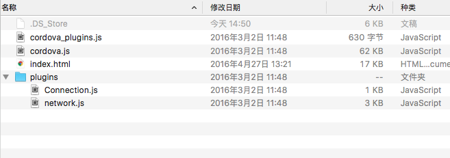

### Cordova相关下载
**Cordova.js及相关下载：**
1. 请根据平台下载相应的cordova.js文件
2. 根据需要添加轻应用需要使用的cordova原生插件，并放到plugins文件夹下（可选）
3. 在cordova_plugins.js中配置使用的cordova原生插件

    cordova轻应用文件结构示例：

**关于Cordova原生插件说明：**

[关于Cordova原生插件扩展](cordovaOrigin.md)
    
    
**Cordova.js下载：**

    Android平台

[cordova.js](res/cordova/android/cordova.js)

[cordova_plugins.js](res/cordova/android/cordova_plugins.js)

***

    IOS平台

[cordova.js](res/cordova/ios/cordova.js)

[cordova_plugins.js](res/cordova/ios/cordova_plugins.js)